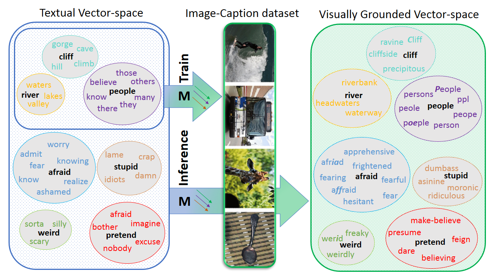

# Language with Vision: a Study on Grounded Word and Sentence Embeddings

This repository contains the source code for '[Language with Vision: a Study on Grounded Word and Sentence Embeddings](https://link.springer.com/article/10.3758/s13428-023-02294-z)' published in [**Behavior Research Methods**](https://www.springer.com/journal/13428).
We have introduced new sets of visually grounded word embeddings based on textual embeddings and image-caption pairs.
Our grounded embeddings show great zero-shot generalization performance across various NLP tasks. We further investigate how to properly bridge language (word embeddings) with vision and analyse the effect of visual grounding on textual embeddings in various ways. Finally, we evaluate our model on a behavioural experiment and show that our embeddings model human behaviour much better compared to purely textual embeddings. The figure below outlines our model and show a random sample of words along with their nearest neighbors for both the grounded and the textual embeddings.


*Our model constructs visually grounded embeddings (right) from textual embeddings (left)
by applying a learned alignment (M) trained on a subset of 10,000 words in image-caption
pairs. It then generates zero-shot grounded embeddings at the inference phase for a total of
2,000,000 words, including not only concrete words but also abstract words. For each query
word (in black), the grounded embeddings (right) retrieve more similar words compared to
the purely textual embeddings (left) and alleviate the bias toward dissimilar words with
high co-occurrence frequencies such as (many, people). Out of the top 10 nearest neighbors
for each query word, only the differing neighbors between the textual embeddings and the
grounded embeddings are reported*

Please check out our paper for numerical evaluation and further analysis. 

## Usage Example
We provide two off-the-shelf versions of our grounded embeddings. One with 300d word-vectors and the other one with 1024d. The small version acheives almost the same performance as the big one (less than 1% drop) on our NLP evaluations. They are both available [here](https://huggingface.co/datasets/fittar/visually_grounded_embeddings) as gensim models. The code snippet below shows how you can load and use the model.

```python
import gensim

#results for 300d vectors
embeddings_300d = gensim.models.KeyedVectors.load_word2vec_format('path_to_embeddings' , binary=True)

#retrieve the most similar words
print(embeddings_300d.most_similar('sadness',topn=5))
[('sorrow', 0.8562467098236084), ('saddness', 0.7652219533920288),
('despair', 0.7651087045669556), ('grief', 0.7619973421096802), ('loneliness', 0.76157146692276)]


#results for 1024d vectors
print(embeddings_1024d.most_similar('sadness',topn=5))
[('sorrow', 0.8404048681259155), ('loneliness', 0.7894531488418579),
('grief', 0.7670776844024658), ('despair', 0.7665526270866394), ('anguish', 0.7611420750617981)]

```


## Getting your own grounded embeddings from scratch

If you need the embeddings in a different dimension or plan to modify the model, you can train the model and generate new set of word embeddings as follows.
## Configuration
- Download the train, validation, and the annnotation of [COCO2017 dataset](https://cocodataset.org/#download) and set the BASE_DATASET_DIR in the config.py file to where the dataset is saved. This directory should include the following: 1. *train_images* 2. *val_images*, containing the training and validation images respectively. 3. *annotations*, including *captions_train2017.json* and *captions_val2017.json*. 
- Download the [GloVe word embeddings](https://nlp.stanford.edu/projects/glove/) (we used *840B tokens, 2.2M vocab, cased, 300d vectors, 2.03 GB*) or any other textual embedding with the same format and set *EMBEDDINGS_DIR* to the directory containing the embedding as a .txt file.
- Set the dimension of grounded embedings by setting *ALIGNMENT_DIM* to your desired dimension.

you can adjust the hyperparamters and rest of the configuation in the config.py.

## Requirments
The model is written in Python 3.8 with tensofrlow 2.8.0. You can easy install the required packages using pip into your virtual environment. You might need to upgrade your pip to 20.0.4 if you encounter any error.

```
pip install -r requirements.txt
```
## Training & Extracting Grounded Embeddings
Run the *main.py* to prepare the datasets and train the model. It will also save the pre-processed dataset (e.g. cnn features) and tokenizer in the *RESOURCES* directory for later usage.
```
python main.py
```
After this step, you can run *extract_embeddings.py* to load the learned alignment and generate zero-shot grounded embeddings. This file will convert the embeddings into a gensim model under the *SAVING_DIR* directory.

```
pyhton extract_embeddings.py
```


## License
MIT

## Citation
if you find our code/embeddings useful please cite our paper:
```
@article{shahmohammadi2023language,
  title={Language with vision: a study on grounded word and sentence embeddings},
  author={Shahmohammadi, Hassan and Heitmeier, Maria and Shafaei-Bajestan, Elnaz and Lensch, Hendrik PA and Baayen, R Harald},
  journal={Behavior Research Methods},
  pages={1--25},
  year={2023},
  publisher={Springer}
}
```


